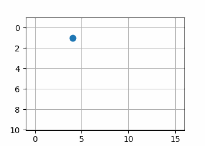
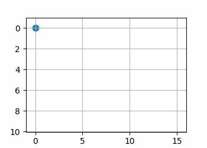
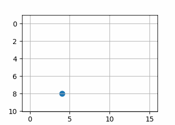
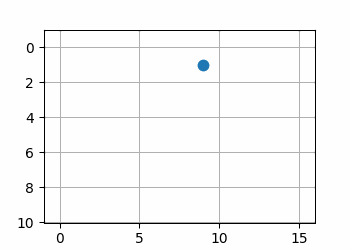
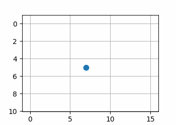

## TODOs

- [x] install ORB3-SLAM and play around with it
- [x] implement map generation
- [x] implement a test for pseudocode
- [x] improve pseudocode
- [x] implement a test for the map generation 
- [ ] integrate ORB3-SLAM and map generation
- [ ] look into path finding algorithm

## Pseudocode

```Python
initialMap()

    intersectionSet = {}
    unfinishedIntersections = {}
    mappingStared = False

    while True:
        if mappingStared and unfinishedIntersections == {}:
            break
        
        driveForward()
 
        if intersection is detected:
            mappingStared = True

            if intersection is not in intersectionSet:
                intersection = CreateIntersectionDataStructure()
                

                if lastintersection:
                    intersection.connection[currExit] = lastintersection
                lastintersection = intersection

                exits = intersection.get_all_exits()
                for exit in exits:
                    intersection.exits.exit.visted = False
                currExit = intersection.get_current_exit()
                intersection.exits.currExit.visted = True
                
                chooseExit = turnLeft() # turn left and return the exit
                intersection.exits.chooseExit.visted = True

                unfinishedIntersections.append(intersection)
                intersectionSet.append(intersection)
                
            else:
                # figure out at which exit we are
                currExit = intersection.get_current_exit()
                intersection.exits.currExit.visited = True
                intersection.connection[currExit] = lastintersection

                ## figure out next exit to turn to
                # count the unvisited exits
                countUnvisitedExits = intersection.exits.count_unvisited()
                # if all exits are visited
                if countUnvisitedExits == 0:
                    # TODO create find nearest unfinished intersection
                    randomExit = intersection.exits.random()
                    turnToThisExit(randomExit)
                    unfinishedintersectiones.pop(intersection)
                
                # if only one exit is not visited
                elif countUnvisitedExits == 1:
                    turnToThisExit(exit)
                    intersection.exits.exit.visited = True
                    unfinishedintersectiones.pop(intersection)

                # if >= 2 exits are not visited
                elif countUnvisitedExits == 2:
                    turnToThisExit(exit)
                    intersection.exits.exit.visited = True
                    break
```

```Python
class intersection():
    exits = [] # List of Exits Coordinates
    neighbors = [] # intersection's that are connected to this one
    dict connections = {} # Dictionary which saves the connection between exit and neighbors

```
### Test Result of the Pseudocode based on python
with different initial points






