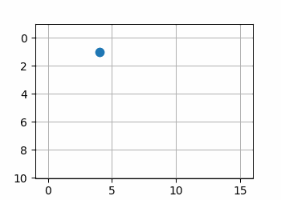
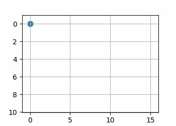
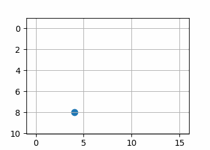
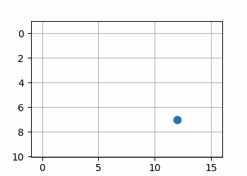
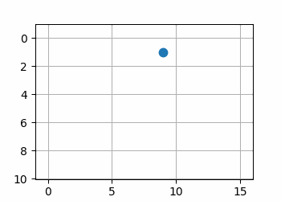

## TODOs

- [ ] install ORB3-SLAM and play around with it
- [ ] implement map generation
- [x] implement a test for pseudocode
- [ ] improve pseudocode
- [ ] implement a test for the map generation 
- [ ] integrate ORB3-SLAM and map generation
- [ ] look into path finding algorithm

## Pseudocode

```Python
initialMap()

    crossSet = {}
    unfinishedCrosses = {}

    driveForward()

    do 
        if a cross is detected:
            if cross is not in crossSet:
                cross = CreateCrossDataStructure()

                currExit = cross.get_current_exit()
                currExit.visted = true
                if lastCross:
                    cross.connection[currExit] = lastCr

                TurnLeft();
                crossSet.append(cross)
                unfinishedCrosses.append(cross)
                lastCross = cross
            else:
                # figure out at which exit we are
                currExit = cross.get_current_exit()
                currExit.visited = true
                cross.connection[currExit] = lastCross

                # figure out next exit to turn to
                for exit in cross.exit:
                    if not exit.visited:
                        turnToThisExit(exit)
                        break
                
                # all exits are visited
                unfinishedCrosses.pop(cross)

                # choose exit on random TODO create find nearest unfinished cross
                randomExit = cross.exits.random()
                turnToThisExit(randomExit)
                

    while (unifinishedCrosses is not Empty):
```

```Python
class Cross():
    exits = [] # List of Exits Coordinates
    neighbors = [] # Cross's that are connected to this one
    dict connections = {} # Dictionary which saves the connection between exit and neighbors

```
### Test Result of the Pseudocode based on python
with different initial points





