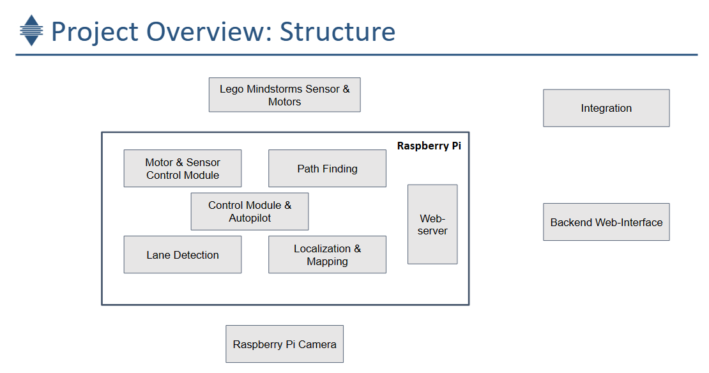
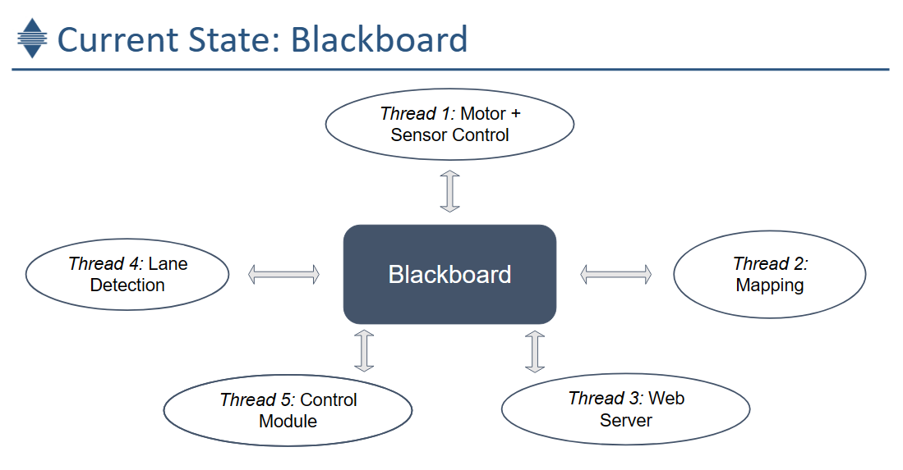
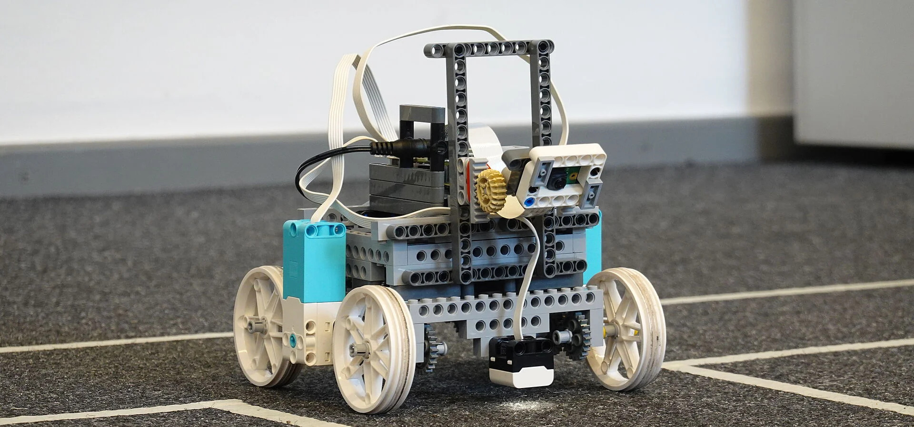

## Master Project Software Engineering of Embedded Systems

This project is for an autonomous driving embedded system project based on raspberry pi and lego. This is the introduction page of this project [link](https://www.tu.berlin/sese/studium-lehre/studierendenprojeke). 

### Details
The Project is based on C++.

Details for [Lane Detection and Mapping and Navigation(Google Presentation)](https://docs.google.com/presentation/d/e/2PACX-1vS4pPdVwxYb7QBpuhTFsbljrOiQwULdkdp8XUpReAefJH3ORhQhm_yxvQbNFgimfd3lhVrHljrLdNas/embed?start=false&loop=false&delayms=60000)

### Results
This is our robot:

